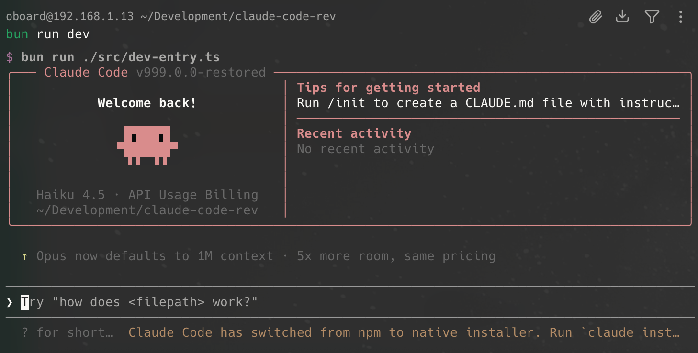

# Claude Code

<p align="center">
  
</p>

<p align="center">
  <a href="#快速开始">Quick Start</a> •
  <a href="#功能特性">Features</a> •
  <a href="#技术栈">Tech Stack</a> •
  <a href="#项目结构">Structure</a> •
  <a href="#贡献指南">Contributing</a>
</p>

---

## ✨ 简介

Claude Code 是 Anthropic 推出的 AI 编程助手 CLI 工具，提供强大的代码编辑、任务自动化和智能辅助功能。

> 本项目是 Claude Code 源码的恢复版本，通过 source map 逆向还原并补齐缺失模块后得到的完整源码树。

---

## 🚀 快速开始

```bash
# 安装依赖
bun install

# 运行 CLI
bun run dev

# 查看版本
bun run version

# 查看帮助
bun run dev --help
```

---

## 📋 功能特性

| 功能 | 描述 |
|------|------|
| 🧠 **智能代码编辑** | AI 驱动的代码补全、重构和建议 |
| ⚡ **任务自动化** | 支持复杂的多步骤任务规划和执行 |
| 🔌 **MCP 集成** | 完整的 Model Context Protocol 支持 |
| 💾 **会话管理** | 强大的会话历史和状态管理 |
| 🔒 **权限系统** | 精细化的工具调用权限控制 |
| 🐛 **调试能力** | 内置调试工具和日志系统 |

---

## 🛠 技术栈

```
TypeScript  ──────  Language
    │
Bun  ─────────────  Package Manager
    │
Node.js 24+  ────  Runtime
    │
    ├──────── Anthropic SDK
    ├──────── Claude Agent SDK
    ├──────── MCP Protocol
    ├──────── OpenTelemetry
    └──────── React + Ink
```

---

## 📁 项目结构

```
claude-code/
│
├── src/                    # 核心源代码
│   ├── bridge/            # 桥接层 (外部通信)
│   ├── assistant/         # 助手核心逻辑
│   ├── bootstrap/         # 启动引导
│   ├── skills/            # 技能系统
│   └── ...
│
├── shims/                 # 兼容层 (Native Bindings)
│
├── vendor/                # 第三方源码
│
├── AGENTS.md              # Agent 配置规范
│
└── package.json           # 项目配置
```

---

## 📌 环境要求

| 工具 | 版本 |
|------|------|
| 🟣 Bun | ≥ 1.3.5 |
| 🟢 Node.js | ≥ 24.0.0 |

---

## 🤝 贡献指南

欢迎贡献代码！请先阅读 [AGENTS.md](./AGENTS.md) 了解项目的 Agent 配置规范。

---

## 📄 License

See [LICENSE.md](./LICENSE.md)

---

<p align="center">Built with ❤️ by Anthropic</p>